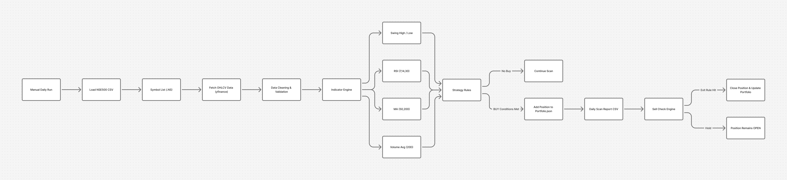

## **📈 Quantitative Swing Trading System — NSE 500 (Python)**

## **This project is designed to be fully reproducible. Clone the repository, install dependencies, and run `trading_system.py` to generate daily NSE500 scan reports.**

**🔍 Project Overview**
This project is a rule-based quantitative swing trading system built using Python and NSE 500 equity data.
The system scans the market daily, identifies high-probability long trades, manages open positions with predefined risk rules, and stores portfolio state persistently.

## 🚀 Live Demo (Interactive)
This project includes an interactive web interface built using **Gradio**. <br>
▶ Users can run the daily NSE500 scan and view results directly in the browser. <br>
🔗 **Live App:** https://manojbhardwaj1-nse500-quant-swing-trading.hf.space <br>
The live interface displays BUY signals, SELL alerts, and full market context.

**The goal of this project is to demonstrate:**
1. Applied quantitative finance concepts
2. Technical indicator computation from raw OHLCV data
3. Clean system design (data → signal → execution → persistence)
4. Production-ready Python engineering practices

**🎯 Problem Statement**
Retail traders often:
1. Rely on subjective chart reading
2. Manually calculate indicators
3. Lack discipline in risk management

## **This system automates decision-making using mathematically defined rules and removes emotional bias.**

## **🧠 System Design (High Level)**
<p align="center">
  
</p>

> High-level architecture of the NSE500 quantitative swing trading system.

1. **CSV (NSE 500 Symbols)** — Static universe of tradable stocks  
2. **Market Data Fetch** — OHLCV data via `yfinance`  
3. **Indicator Engine** — RSI (7, 14, 30), Moving Averages (50, 200), Volume metrics  
4. **Signal Generator** — BUY / HOLD / SELL decision logic  
5. **Portfolio Manager** — JSON-based position tracking and persistence  
6. **Daily Scan Report** — End-of-day CSV output for analysis

## **⚙️ Detailed Workflow (Step-by-Step)**
### **Step 0 — Universe Selection**
- NSE 500 stocks are used as the trading universe
- Symbols are loaded from: "data/ind_nifty500list.csv"

### **Step 1 — Market Data Collection**
- Historical OHLCV data is fetched using yfinance
- Timeframe: Daily
- Lookback window ensures stable indicator calculation
### Why yfinance?
- Free
- Reliable
- No NSE API instability
- Suitable for research & prototyping  

### **Step 2 — Indicator Calculations**
📌 Relative Strength Index (RSI)
- RS is calculated as $$RSI = 100 - \frac{100}{1 + RS}$$
Where:
$$RS = \frac{\text{Avg Gain}}{\text{Avg Loss}}$$
**Periods used:**
- RSI(7) → Short-term momentum
- RSI(14) → Standard momentum
- RSI(30) → Medium-term trend exhaustion 
### Purpose:
- Identify oversold conditions within an uptrend.

### 📌 **Moving Averages (Trend Filter)**
- 50-day SMA and 200-day SMA
### Used to:
- Filter trades in broader uptrends
- Avoid counter-trend entries
### Conditions:
- Price > 200 SMA OR 50 SMA > 200 SMA

### 📌 Volume Expansion Logic
- 20-day average volume is calculated
- Current volume must be:
- **Volume > 2.5 × Avg_20_Day_Volume**

### Purpose:
- Ensure institutional participation behind price movement.

### **Step 3 — BUY Signal Logic**
- A BUY signal is generated only if ALL conditions are met:
- RSI(14) < 30
- RSI(7) < 35
- RSI(30) < 40
- Trend filter satisfied
- Volume expansion confirmed
- Bullish confirmation candle: [Close > Open] and [Close > Previous Close]

### **Step 4 — Risk Management & Trade Structuring**
### Each trade is structured before entry:
- Stop-loss: 7%
- Target: 10%
- Risk is predefined and fixed
### This enforces:
- Capital protection
- Consistent expectancy
- Repeatable execution

### **Step 5 — Portfolio Persistence**
- All open and closed trades are stored in: "portfolio.json"
### Stored fields:
- Entry price & date
- Stop-loss
- Target
- Exit price
- Exit reason
### This allows:
- Restarting the system without data loss
- Auditability
- Future performance analytics

### **Step 6 — Reporting**
- Daily scan results are saved as: "reports/scan_YYYYMMDD.csv"
### This enables:
- Manual review
- Historical signal analysis
- Easy demo recording

## **▶ How to Run Locally**
```bash
### 1️⃣ Clone the repository
git clone https://github.com/manojbhardwaj1/nse500-quant-swing-trading
cd nse500-quant-swing-trading

### 2️⃣ Create virtual environment
python -m venv .venv
Activate it:
- Windows 
.venv\Scripts\activate
- Linux / macOS 
source .venv/bin/activate

### 3️⃣ Install dependencies
pip install -r requirements.txt

### 4️⃣ Run the system
Run full batch scan (CLI) 
python trading_system.py 

Run interactive Gradio app 
python app.py
```
## 🛠 Tools & Technologies Used
- **Python 3.9+**
- **pandas** — data processing
- **numpy** — numerical computation
- **yfinance** — market data
- **Gradio** — interactive web UI
- **Hugging Face Spaces** — live deployment
- **Gradio** — interactive web UI
- **Hugging Face Spaces** — live deployment
- **JSON / CSV** — lightweight persistence
- **VS Code** — development
- **Git & GitHub** — version control

## **🧩 Design Choices Explained**
- ❌ No live order execution (intentional)
- ❌ No NSE website scraping (unstable)
- ❌ No databases (kept simple & portable)
- ✅ Deterministic rule-based logic
- ✅ Easily extensible for backtesting

## 📌 Future Enhancements
- Vectorized backtesting engine  
- Performance metrics (CAGR, Sharpe ratio, max drawdown)  
- Strategy optimization (parameter sweeps, walk-forward analysis)  
- **Statistical hypothesis testing for signal validation**  
> Hypothesis testing will be used to statistically validate whether observed returns are significantly different from random market behavior.
- Scheduled daily runs (Task Scheduler / Cron)  
- Interactive visualization dashboard (PnL, equity curve, signals)

## **⚠️ Disclaimer**
- This project is for educational and research purposes only.
- It is not financial advice.

## **👤 Author**
**Manoj Bhardwaj** <br>
Applied Mathematics | Quantitative Finance | Python <br>
📍Bangalore, India


